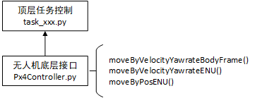
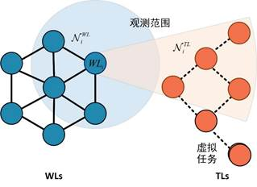

# 32s_QingLiangHua
32s结题飞行演示程序。动捕环境3机穿3环。

## 准备
* 飞机和环粘上动捕球，编号为`BUAA_0x`和`CIRCLE_0y`
* 修改`_scripts/zzfly_startup.sh`的`mav_id`，修改`motion_capture_system/mocap_pose/launch/mocap_vrpn.launch`的`vrpn_topic`
* 订阅动捕发布的话题，是否为`/vrpn_client_node/BUAA_{:02d}/pose`

## 使用
```
./_scripts/zzfly_startup.sh
```

## 说明

### 任务控制及无人机接口：`offboard_pkg`



基于[mavros](http://wiki.ros.org/mavros#Usage)封装了`Px4Controller.py`用于向无人机发送速度和位置指令。

`task_base.py`中定义了一些基础的接口测试任务。可以通过`main.py`进行硬件测试,，通过基本的速度指令和位置指令测试控制无人机硬件是否调试完成。

在实飞环境中，三架无人机完整自主决策任务。无人机实飞状态下，通过控制终端内置程序统计感知定位到协同决策计算时间，通过计算版功率监视软件统计计算系统总功耗。

### 动补接口：`motion_capture_system`

动补程序的接口，推送动补获得的位置真值。

修改`motion_capture_system/mocap_pose/launch/mocap_vrpn.launch`中的配置文件`vrpn_topic`。

该topic话题需要与动补系统中的目标相对应。

### 分配算法：`Graphical`

当我方集群较密集飞行，飞行器间保持相互观测。或者通信可靠尚未收到干扰时，可以认为位置感知确定。此时通过自我观测的目标结果，可以推算出其他飞行器与目标的距离和收益值。

由于每个无人机各自独立决策，对于公共目标存在竞争的关系，本报告应用博弈的思想描述这类多目标分配问题。如图1所示，因为每个无人机感知范围有限，无人机只能知道周围几个友方无人机相对位置。前视摄像头采用多焦段相机，可以估计敌方部分目标位置。进行决策时，本报告选取画面中心区域的几个敌方目标，保证相邻无人机也能看到目标。注意$WL$的收益只与那些邻域内有相同获选人的其他$WL$有关，而不是整个工作列表。描述这种局部强耦合性。



该程序实现了：

a) 在半物理仿真环境下，针对协同搜索任务场景开展验证，集成分布式蜂群目标动态分配算法模型的无人机集群软件验证系统能够完成无人机集群对未知目标的分布式搜索任务。

b) 设置 20次半物理仿真场景重复实验，评估仿真场景中分布式蜂群目标动态分配算法的准确率和决策时间，准确率需大于等于95%，单次模型决策时间小于等于10毫秒。

c) 设置 20次半物理仿真场景重复实验，评估仿真场景中经典的集群分布式任务分配算法——拍卖算法的决策时间，计算本研究分布式蜂群目标动态分配算法的加速倍数。模型实现5倍以上加速。